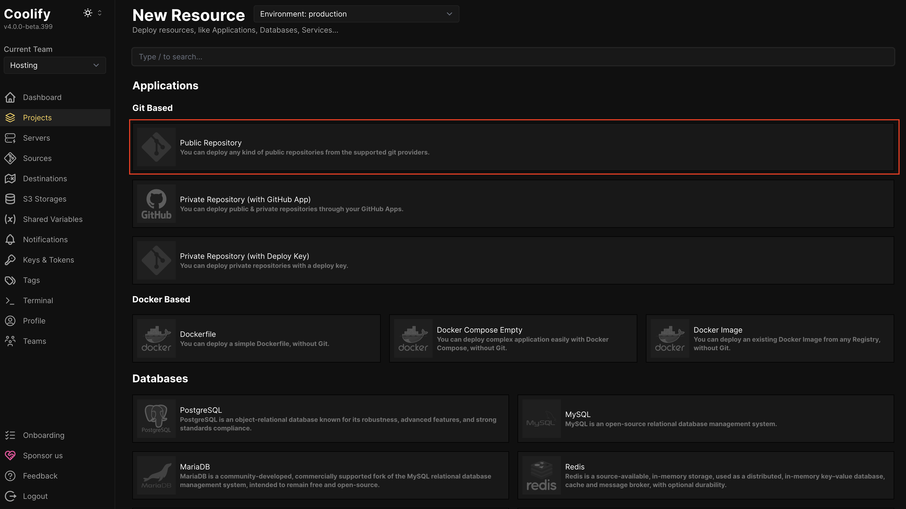
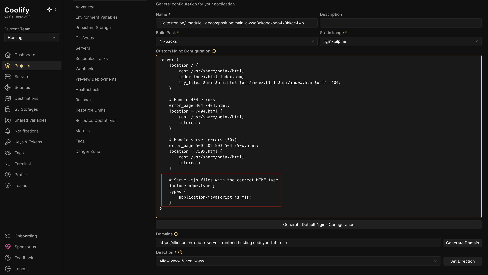

## Creating a frontend

**Click "Add New Resource"**


**Add the GitHub repository**

The hosting platform needs to know where to get your backend from.

You probably want to add a "Public Repository" Git Based repository, to tell it your project is in GitHub.

If you want your application to auto-deploy when you push changes to it, you'll need to instead choose "Private Repository (with GitHub App)" and set up a GitHub App yourself.



Open your GitHub in another tab, and **copy the HTTPS Clone URL**


Go back to the CYF Hosting and **paste the URL into the "Repository URL" field**


**Click "Check repository"**.

Click **It is a static site?**.

Press **Continue**.

## Configuring the frontend

Most things should Just Work.

There are some things you may want or need to configure. If you do change any, you need to press the **Enter** key to save the change.

If your frontend is located in a subdirectory of the repo, you should set the **Base Directory**.


You may want to choose a friendly/memorable **Domain**:


If you want to deploy from a branch that isn't `main`, you need to configure this in the Git Source tab:


## Add NODE_ENV to Your Project

**Required for:** All Node.js projects (anything that has a `package.json` file) 

### Steps

1. Click on **"Environment Variables"** in the left sidebar
2. Click the **"+ Add"** button


3. Fill in the form:
   - **Name:** `NODE_ENV`
   - **Value:** `{{team.NODE_ENV}}`
   - Make sure **"Available at Build time" is not checked** ❌  
   - Make sure **"Available at Runtime"** is checked ✅ 


4. Click **"Save"**

## Deploying the frontend

When everything is configured correctly, press the **Deploy** button:


Watch the logs. Fix anything that goes wrong. When the deploy is finished, you can test out your frontend.

## Fix MIME types

If your frontend uses `.mjs` files, you need to customise the Nginx configuration so that these are served with the correct MIME type.

Do this by:

Pressing **Generate Default Nginx Configuration**


Paste this text before the final `}` in the generated config:

```
    # Serve .mjs files with the correct MIME type
    include mime.types;
    types {
        application/javascript js mjs;
    }
```



Save the configuration, and deploy again.

We hope to make this step unnecessary in the future.
