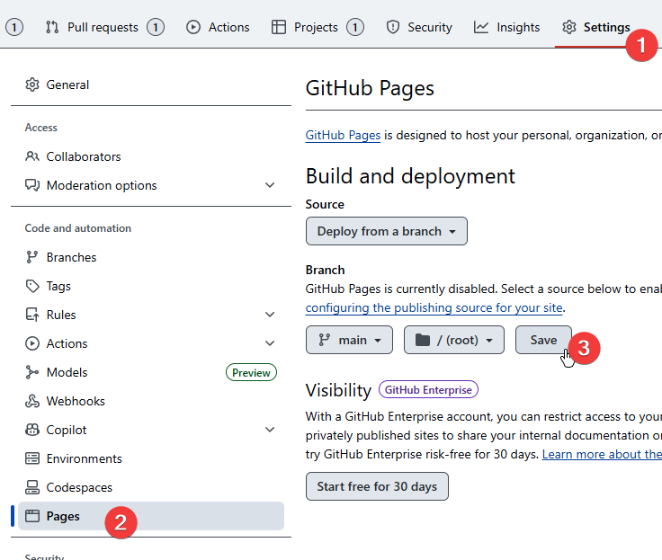

## Intro
As well as hosting code and offering tools like pull requests, GitHub also gives you the ability to host simple static websites, so if you need a place to host a basic HTML page, you can use GitHub pages.

This page has a basic tutorial on how to get started with this.
If you want to explore more complex uses of GitHub Pages, you can read their [documentation](https://docs.github.com/en/pages).


GitHub pages won't work if you need a backend or a database, for that you should consider a different hosting environment.
There is no logging available for GitHub pages once deployed, so if you need complex debugging during deployment it may not suit your needs.


## How To Deploy
GitHub pages can work by simply making the files available on a particular branch available online.
This works best if you have HTML, JavaScript and CSS files all stored in a branch that you want to host on the web.
GitHub pages assumes that you will have an `index.html` file in the root directory of your repository.

Here's how you deploy with GitHub:

1. Find your repository's page on github.com and click on "settings" using the top navigation bar
2. Navigate to "Pages" settings
3. Select the branch you want to deploy and click "save" to make it public

The page can take up to a minute to deploy, depending on how large your repository is.
After a short wait while the page is deployed, you can access it at:

`https://YOUR_USERNAME.github.io/REPOSITORY_NAME/`

