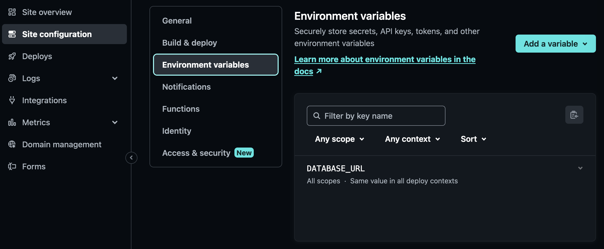

+++
title="Deploying Express"
description="How to deploy an Express.JS backend to Netlify"
weight=3
+++

## 🔌 What are Netlify Functions?

[Netlify Functions](https://docs.netlify.com/functions/overview/) allow us to deploy some backend systems. This feature is designed for serverless frameworks, but supports Express.JS as well with some limitations.

## 🗂️ How to organise your files

To deploy an Express.JS backend to Netlify you need to make sure that your backend meets the following requirements:

### ✅ Checklist

- [ ] **All of your backend paths start with `/api`**. For example `/api/videos`, `/api/bookings/1`, etc. Every other URL will be considered as part of the frontend.
- [ ] **Your backend code is organised** like this:
      a. `/server/api.js` contains your actual backend functionality. You can include other modules from this file if you wish to split the file into multiple modules. This file is used by Netlify.
      a. `/server/server.js` starts up your express.js server and contain settings to load up `api.js` to serve everything under `/api`. This file is used for local development.
- [ ] **Your backend does not use global variables to save data** between requests. All persistence is done through the database or by using cookies.

Once you have checked your backend meets the requirements, you are ready to add support for Netlify.

## ⚙️ Define Netlify config

Create or locate a `netlify.toml` in your root repository. Append the following code:

```toml
[functions]
  directory = "server/functions"
  external_node_modules = ["express"]
  node_bundler = "esbuild"
[[redirects]]
  force = true
  from = "/api/*"
  status = 200
  to = "/.netlify/functions/app/:splat"
```

## 🧰 Add Serverless HTTP

1. Create a file called `app.mjs` inside `/server/functions`. Make sure it has the following content:

```js
// Netlify wrapper for express.js
import express from "express";
import serverless from "serverless-http";
import apiRouter from "../api";

const app = express();

app.use(express.json());
app.use("/api/", apiRouter);

export const handler = serverless(app);
```

This will convert your express.JS application into a serverless lambda that is compatible with AWS Lambda and Netlify Functions. Note that this has a large performance impact as your entire express system needs to load up for every single request. Each request runs in isolation so you are unable to share or cache values in your codebase. (For example the database connection will be recreated at every call.)

2. If you need to use any middleware apart from `express.json()`, include this now.

3. Add `serverless-http` into your `package.json` file:

```bash
npm i --save serverless-http
```

## 💾 Connect your database

If your backend uses a database, set up a `DATABASE_URL` environment variable inside Netlify. This environment variable should point to your database.


Check the guides on your chosen database provider to see how to obtain the value of `DATABASE_URL`.




## 🚀 Deploy!

Try deploying your application. Your backend paths should be accessible under `https://<name-of-your-app>.netlify.app/api/`

If you are stuck, explore [FSA Netlify](https://github.com/sztupy/Full-Stack-Project-Assessment/tree/netlify_000) that showcases the above requirements. As an example check this [API call](https://cyf-fsa-solution.netlify.app/api/videos)
