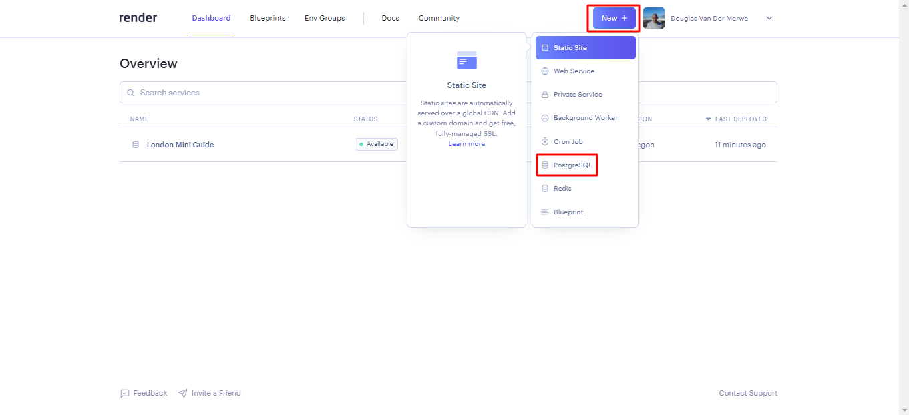
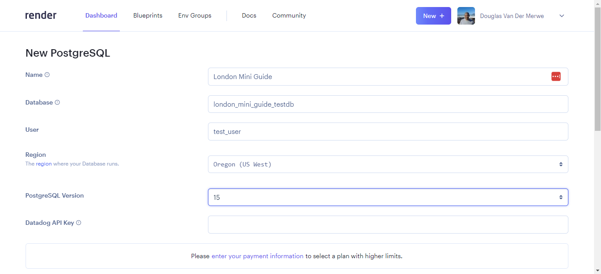
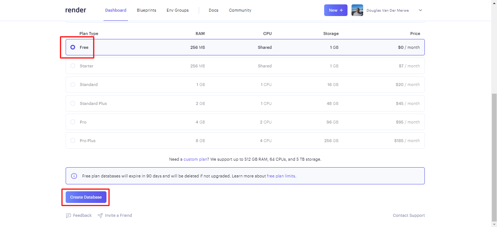
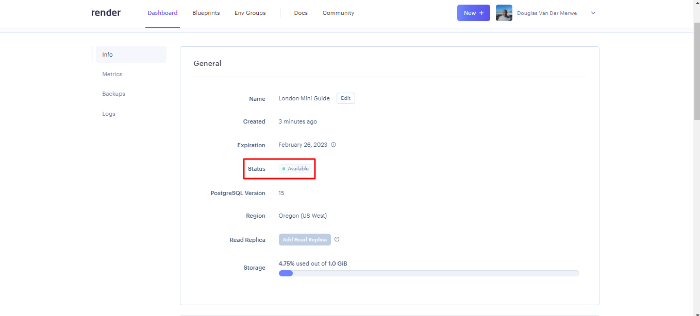
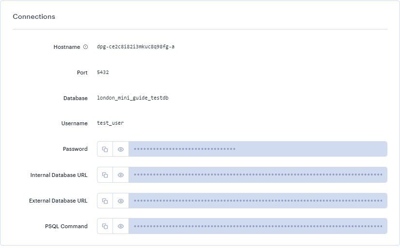
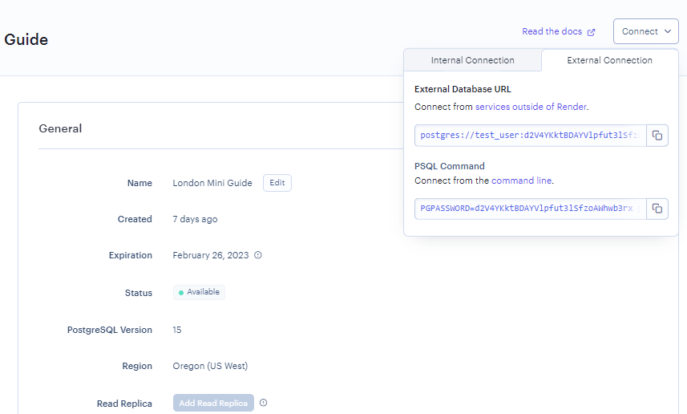

1. 

2. Fill out the Name field, which will be used to label the database within Render. Fill out the Database and User fields, which should be the same as your development environment - ask a volunteer if you are unsure. Leave the remaining 3 input fields as is with the default values 

3. 

4. 

5. 

6. 

7. If you are using a Render database outside of Render, you'll need to use the External Database URL. If you are using the database inside of Render, you should use the Internal Database URL.

8. 
