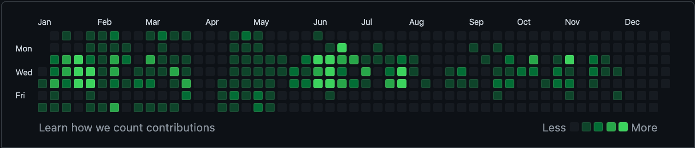

Do as much work in public on your GitHub as possible. Employers will look at your GitHub, and they like to see the following:

- ### Active commits

  Lots of green on the profile graph, well distributed over time

- ### Regular coding

  Pull requests, code review, general competence with git and Github

- ### Evidence of you using the languages you list on your CV

- ### A portfolio of projects
  At least some self-organised passion projects you have done outside of class

You don't have to code every day, but you do have to code regularly. Here are some things to check now:

- [ ] Do you have regular commits on GitHub?
- [ ] Does your activity reflect the skills and technologies you want to demonstrate to employers?


Make sure your private contributions show as activity in settings


### Contributions

As well as your CYF projects and your passion projects, you can show your passion for development by [contributing to an open-source project](https://www.firsttimersonly.com/).
