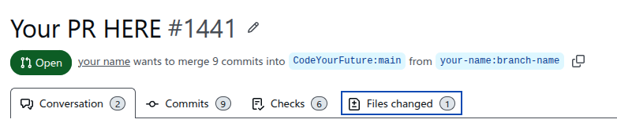
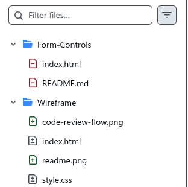

+++
title="Fixing a PR Branch"
description="Learn how to fix a branch that has the wrong files on it"
time=20
objectives=[
    "Correctly make new branches from main",
    "Recognise when a branch doesn't meet PR requirements",
    "Fix a branch with the wrong files on it",
]
+++

## Making a new branch 

While learning at Code Your Future, you will develop lots of projects and backlog tasks.
While working on projects you will be using branches and PRs in Git and GitHub.

You might be: 
* Forking projects, working in a branch, and submitting finished backlog items as PRs
* Working in a team on a project, sharing the work in branches, and reviewing each other with PRs

To make a PR you first need to make a branch and develop some code there.
Branches are made in Git, on your own machine.
PRs are made in GitHub.

To avoid problems, you should only create a new branch when you are on the *`main`* branch.

### In VS Code
Here is a summary of the correct way to make a branch in VS Code:

1. You are ready to start a new piece of work
2. Switch back to the main branch in VS Code by clicking on the branch name in the bottom left corner
3. Create a new branch, named for the thing you are about to work on
4. Start editing and making commits

You can see extra guidance for how to [manage branches on VS Code here](https://code.visualstudio.com/docs/sourcecontrol/branches-worktrees).

If you are working on multiple tasks at once, always check which branch you are currently working in, so you do not commit to the wrong one.

### Command line
If you are using the command line, you do it this way:

```sh
# move to the right directory
cd your-code-directory
# switch back to the main branch
git switch main
# make a new branch and switch to it
git switch -c your-new-branch-name 
# the first time you push on a new branch, tell github you are using a new branch:
git push --set-upstream origin your-new-branch-name
# afterwards you can simply use
git push

```

Before you make a commit, you can check which branch you are currently on using the `git status` or `git branch` command.
Take care to do this if you are working on multiple tasks at once.


## Spotting Problems with Branches
When you are [submitting a PR on GitHub](/guides/reviewing/trainee-pr-guide/), always check to see if you received automated feedback from bots.

Sometimes, a bot will leave a comment like this:

```text
The files changed in this PR don't match what is expected for this task.
Please check that you committed the right files for the task, and that there are no accidentally committed files from other sprints.
Please review the 'files changed' tab at the top of the page.
Here is an example of a file that has been incorrectly committed: 
```

Always read and follow the bot's instructions.
The first thing you should do is have a look for the example file given in the _files changed_ tab on your PR.
This tab shows you everything you have changed in the branch you are submitting to the PR.
You can check it by clicking the link labelled _files changed_ at the top of the page:



Then, have a look at the file tree on the left of the page:



You will see 3 types of file, all of these represent "changes" from the original:
* **Green +** icon means newly created files
* **Red -** icon means you deleted this file
* **Grey ±** icon means you made some changes to an existing file

Think about the folders these files are in.
If the PR you are working on is, for example, a _wireframe_ task, you should only be submitting changes in the _wireframe_ directory.
In the example above, we see changes have been made outside that directory, in the _form controls_ directory.
This lets us know that something has not been committed in the right place.

Your own personal projects may not have a bot to check this, so it is worth double-checking the files changed tab yourself when you make a PR to ensure only the right changes are being submitted.

## Fixing a branch which changed the wrong files

The most common cause of branches having the wrong files are:
* You forgot to go back to `main` before branching
* You were working on multiple tasks and forgot to switch branch

To solve the problem, what we want to do is put the files back the way they were originally, before you made the changes.
This is called "reverting".
There are several ways to do this with git and VS code, the simplest one requires you to use the terminal.

### Using the terminal
1. Identify which branches are your "original branch", and which one is your "pr branch" with changes
    * For this example, we will imagine the original is `main` and the pr branch is `wireframe`
2. Identify which directory or file has the incorrectly changed files we want to revert
    * For this example, we will be reverting the whole `Form-Controls/` directory
3. Open the terminal in VS Code
4. Check you are in the right directory where your code is
5. Make sure you are on the PR branch by typing `git switch wireframe`
6. Check out all the original files using this command: `git checkout main Form-Control`
    * This tells git to look at the main branch, and check out every file in the Form-Control directory, into the current wireframe branch

You now need to re-commit these files and push them.
You can do this the normal way in VS Code, or in the command line.
Once you have done these steps, go back to the PR page on GitHub and check the "files changed" tab.
It should no longer show the incorrectly changed files and only have the ones you intended.

You can also use this technique if you were working on multiple tasks in different branches and incorrectly committed to the wrong branch.
To do this, swap around the `main` and `wireframe` in the above instructions to match whichever branch you are currently on, and which one you want to check files out from.
