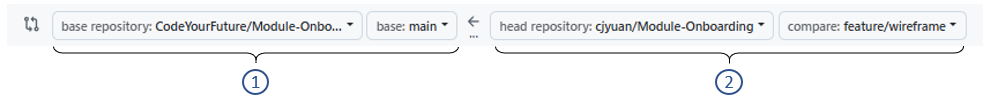

+++
title="Trainee PR Guide"
description="What trainees should know about PR in  courses"
weight="2"
+++

## What is a Pull Request (PR)?

A **pull request**, or **PR**, is a way to share your code for review.
In professional projects, PRs are used to suggest changes and then merge them into the main project.

At , we use PRs mainly as a way for you to submit your work for review and feedback.
Think of it like handing in an assignment - the PR is the place where you "submit" your code so 
mentors and teammates can:
- ✅ See what you changed (new code, fixes, or features)
- 💬 Discuss the changes (comments, suggestions, or questions)
- 👍 Review and provide feedback (approve or request improvements)

For most coursework, merging will not happen. You will update your code based on feedback, learn 
from the process, and keep practicing.

To get the most out of a PR, follow these steps to get 
clear feedback, show your progress, and learn more effectively.

## Preparing a PR Branch

### Keeping a branch clean

A **clean branch** contains only the work you want to share, nothing more.
It makes your PR easier to review.

To keep your exercise branch clean:

1. **Create your branch from `main`**.

2. **Keep `main` clean and updated**.
    - _Clean_ -> no changes should be committed to `main`.
    - _Updated_ -> regularly use
     [Sync Fork](https://docs.github.com/en/pull-requests/collaborating-with-pull-requests/working-with-forks/syncing-a-fork)
     to keep your repo up-to-date with the upstream repository.

3. **Make only related changes**.
    - Add or modify only the files in the folder related to the exercise.

### Keeping code clean

Clean code makes it easier for you, your teammates, and your reviewers to understand and
work with.

Please read the [Code Style Guide](../style-guide/) carefully
to learn how to keep your code professional.

### Get a second opinion from AI tools

Before submitting a PR, you can use AI tools to review your code, documentation, or explanations.

AI can help you:
- Spot typos, formatting issues, or unclear comments.
- Suggest possible improvements to your code or approach.
- Highlight missing edge cases or potential problems.

Think of AI as a second pair of eyes -- helpful for polishing your work.  
And don’t worry: using AI is **not cheating**. You can accept AI suggestions, but only if you 
understand them well enough to explain the change. Once you can do that, the learning truly becomes 
yours.


## Opening a PR

### Selecting source and target branches



- (1) **Target branch**: The branch you want to compare against (normally `main` in 's repo).
- (2) **Source branch**: The branch in your fork where you prepared the files for the exercise.

### PR Title
A consistent title format makes pull requests easier to track, search, and review.


In  courses, you can typically find the title format in the PR template.

For example,
```
  Region | Cohort | FirstName LastName | Sprint | Assignment Title
```  
means the title should have 5 components separated by a vertical bar character (`|`)

- **`Region`**: One of 
  - `Birmingham`
  - `Cape Town`
  - `Glasgow`
  - `London`
  - `Manchester`
  - `Sheffield`
- **`Cohort`**: In the form `<Year>-<Course name>-<Cohort starting month>`
  - e.g., `25-ITP-Sep`
- **`FirstName LastName`**: 🙄
- **`Sprint`**: `Sprint 1`, `Sprint 2`, ...
- **`Assignment Title`**:
  - Project's name
  - The name of the backlog issue is generally a good thing to use.
  - The **title** (if any) stated in the "How to Submit" section in the backlog corresponding to
    the exercise



### PR Description

The **PR description** is where you explain what your changes are and why you made them.
It helps reviewers quickly understand the context without having to read all the code.

The PR template in  courses typically contain the following sections:

#### 1. Self-checklist

The self-checklist helps you remember important steps, shows reviewers you've prepared your work, 
and speeds up the review process - while building good professional habits for real-world projects.

You should only tick items you've truly completed, check every box before submitting, 
and treat the checklist as both your responsibility and a learning tool - ask for help if you're 
unsure.


Complete every task described in the checklist, and mark each one as done.

To check a box in Markdown, write `[x]` (a lowercase '`x`' with no spaces inside the brackets) 
to mark it as checked.

For example, change
```
- [ ] My changes meet the requirements of the task
```
to
```
- [x] My changes meet the requirements of the task
```


#### 2. Changelist

The **Changelist** section is a short, bullet-point summary of the key changes in your PR, 
helping reviewers quickly understand what you did and why.


Replace the placeholder text `Briefly explain your PR` by a brief description of your changes.


#### 3. Questions

The **Questions** section lets you highlight parts of your work you're unsure about, 
so reviewers can give you targeted feedback and help you learn.


Replace the placeholder text by your questions, or delete the section if you don't have any.


## After Opening a PR

### Use labels to communicate the PR status
Reviewers will not check your PR unless it has the right label.

- Add the **`Need review`** label to the PR.
  - For details about how to use labels in a PR, please refer to the [Using Labels](./using-labels/)
  Guide.

### Check for automated feedback

Here at CYF we use a bot to do some automated checks on your pull request.
If you ever get a reply from the bot, that means something needs to be fixed on your pull request.
This could mean something is missing from your submission, a problem in the title or description, or an issue with your submitted files.
If you see a comment in your PR from the user called **`github-actions`**, here's what to do:

- Carefully read the comments from the bot, this will explain what you should change
- Do this change and the bot will automatically check your submission again
- After making a change, if the bot leaves another reply, read it again and try to fix the problem
- If you still don't understand what needs fixing, ask for help on slack
- Once you have resolved the issue, add the **`Need review`** label again to your PR

Learning how to respond to automated checks is important, because these kinds of tools are often used in software development work.

### Wait for Review
  - It may take up to a week (sometimes longer) before someone starts reviewing your PR.
  - Your PR will appear on one of the PRs Needing Review pages -- please do not post messages like 
    "Please review my PR ..." on Slack.
    - [ITP PRs needing review](https://programming.codeyourfuture.io/prs-needing-review/)
    - [SDC PRs needing review](https://sdc.codeyourfuture.io/prs-needing-review/)

## Addressing Reviewer Feedback

Responding to PR feedback is like a conversation: **listen**, **reply thoughtfully**, and 
**show that you acted on feedback**.

1. **Be respectful and collaborative**
    - Treat comments as opportunities to learn, not criticism.
    - Even if you disagree, respond politely and explain your reasoning.

2. **Acknowledge feedback**
    - If you agree -> say _"Good point, I'll fix it."_
    - If you don't fully agree -> say _"I see your point. Here's why I approached it this way ..."_
    - **Don't ignore comments** -- silence can feel dismissive.

3. **Make changes, then confirm**
    - After addressing a comment, let the reviewer know (e.g., _"I've updated the variable name 
      as suggested."_).
    - This shows you're actively engaging in the review.

4. **Ask questions if unclear**
    - If you don't understand a suggestion, ask for clarification.
    - Example: _"Could you explain what you mean by simplifying this function?"_
    
After you have taken action and replied to your feedback, you should add the **`Need review`** label again, so the reviewer knows you are ready for your submission to be checked again.




**Markdown** is a language for formatting plain text.
You can use Markdown syntax, along with some additional HTML tags, to format your writing on GitHub, 
in places like repository READMEs and comments on pull requests and issues.

To learn how to write in Markdown, embed image, tag users, and other advanced features,
visit [GitHub Docs - Basic writing and formatting syntax](https://docs.github.com/en/get-started/writing-on-github/getting-started-with-writing-and-formatting-on-github/basic-writing-and-formatting-syntax).


