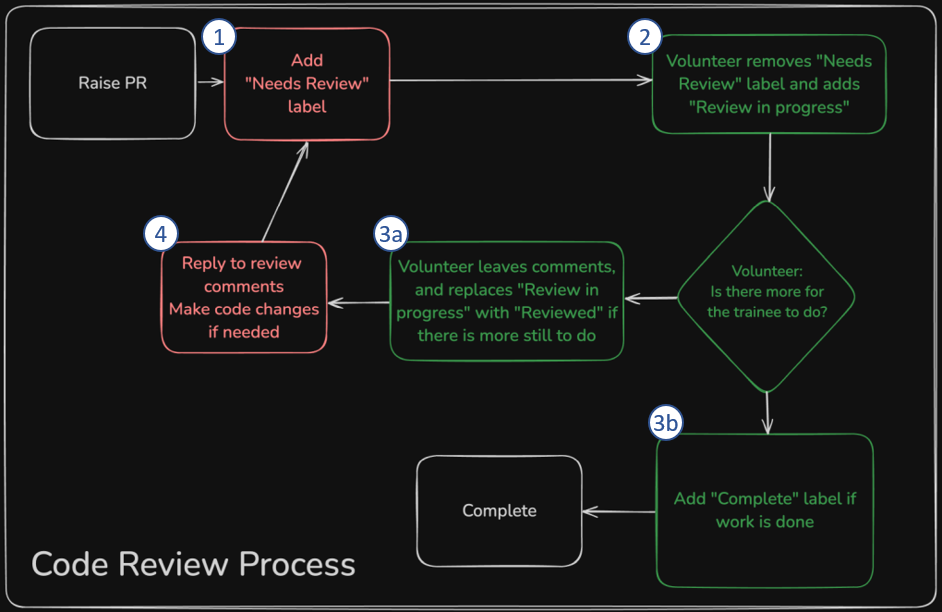

+++
title = "Using Labels"
description="How to make your PR easier to understand and track"
emoji = "🏷️"
weight = 3
+++

## Overview

In CodeYourFuture's courses, we use PRs a little differently.
For most coursework, merging is not required. Instead of relying on "approve and merge,"
we use labels to show the state of a PR.

The four labels are:
- `Needs review`
- `Review in progress`
- `Reviewed`
- `Complete`

The section below shows how to use them during a code review process.

## Review Process

- (1) When a trainee opens a PR, they adds the `Needs review` label.
- (2) When a mentor starts reviewing a PR, they remove `Needs review` and add `Review in progress` so 
  that other mentors know not review it simultaneously.
- (3) When a mentor finishes their review,
    - (a) If more work is needed, they replace `Review in progress` with `Reviewed`. 
    - (b) If the PR is complete, they replace `Review in progress` or `Reviewed` with `Complete`.
- (4) When a trainee has addressed all reviewer feedback, they replace `Reviewed` with `Needs review`.

## Label Summary

- `Needs review` - Added by a trainee when a PR is created or after addressing all feedback; replaces `Reviewed`.
- `Review in progress` - Added by a mentor to show the PR is currently being reviewed.
- `Reviewed` - Added by a mentor when review is done but changes are still needed; replaces `Needs review` and `Review in progress`.
- `Complete` – Added by a mentor when the PR is fully approved and no further work is needed.
