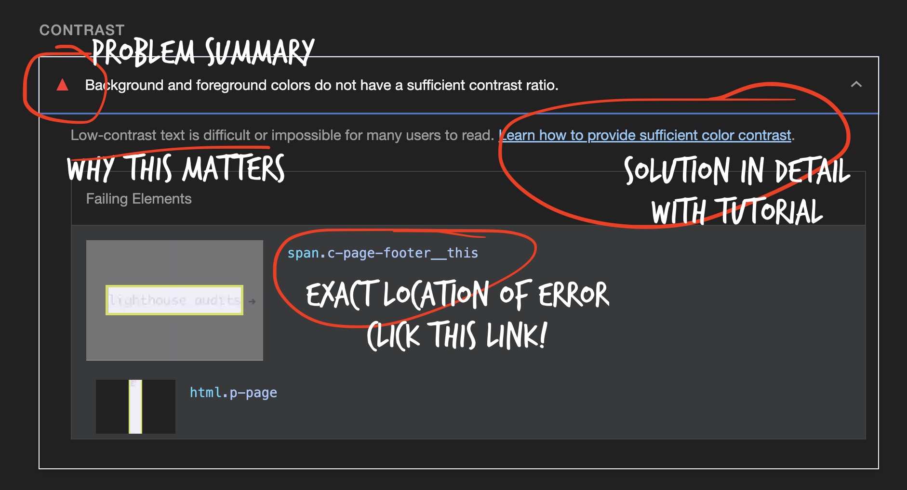

+++
title="Lighthouse Audits"
description="Learn how to audit your webpage"
[[blocks]]
name="Lighthouse Guide"
src="https://developer.chrome.com/docs/lighthouse/overview#devtools"
caption="Lighthouse Documentation in Chrome DevTools"
+++

[Lighthouse](https://developer.chrome.com/docs/lighthouse/overview) is an open-source, automated tool for improving the quality of web pages. It has audits for performance, accessibility, progressive web apps, SEO and more. At , we require all web pages you write to score 100 for Accessibility as a minimum standard.

## How to run an audit

1. Open a webpage in Chrome.
2. Right-click on the page and select [`Inspect`](https://developer.chrome.com/docs/devtools/open).
3. Click on the [`Lighthouse`](https://developer.chrome.com/docs/lighthouse/overview#devtools) tab.
4. Under `Categories`, check `Accessibility`. (Uncheck the other categories for now to make your report simpler.)
5. Click the `Analyze page load` button.

## How to read and use the report

Lighthouse is your friend! Lighthouse will go through your code and show you how to fix everything. Under the top score, you will see a list of items that need fixing. You must click on the triangle to see the details.

#### Click on the disclosure triangle to open the details

Each item will have a description of the problem and why it matters for users. It will identify the exact location of the problem in your code and link you to [a detailed explanation of how to fix it](https://dequeuniversity.com/rules/axe/4.10/color-contrast).

### Fix the issues one by one

Work through the list of issues one by one. Fix **one error** and re-run the audit to check your progress.

> [!TIP]
> If you can't fix an issue, open a draft PR and ask for help. We are here to help each other!

## Try it out

1. Open any HTML project in [VS Code](https://code.visualstudio.com/).
1. Launch the index with [Live Server](https://marketplace.visualstudio.com/items?itemName=ritwickdey.LiveServer).
1. Inspect the page and run a Lighthouse audit.
1. Revise your code to solve the problem and improve the score.
