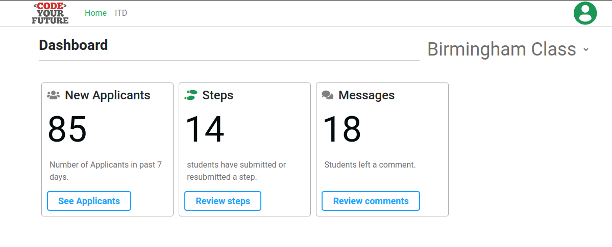

+++
title="Accessing the Dashboard"
author="Tony Beaumont"
description="How to access the dashboard"
time=15
+++

## How to access the Dashboard

These instructions come from **Step 4** in the `#cyf-intro-to-digital-course` canvas ([https://codeyourfuture.slack.com/canvas/C01332PNRTN](https://codeyourfuture.slack.com/canvas/C01332PNRTN) so please refer to that first as it contains links to the instructions your should follow to access the dashboard. The information below is just designed to summarise those instructions..

1. Volunteers need to access the Dashboard [https://dashboard.codeyourfuture.io/](https://dashboard.codeyourfuture.io/)
1. Sign in using GitHub.
1. If you are just registering as a new volunteer you should complete the application form.
1. If you have already registered, click the link at the top which says
   ```console
   Important: If you already completed this form in some point please click here.
   ```
   This takes you to a page where you enter your email address and you will then get sent an email to confirm your login and thereafter you will be able to access the dashboard directly. If you have problems, post a question into the slack channel `#cyf-intro-to-digital-course`<br/>
1. Once you are in, the home screen of the dashboard looks like this:<br/>
   <br/>
   The menu at the top has links to the home page and the ITD programme. There will be other programs linked here as and when they start and have applicants on them.
