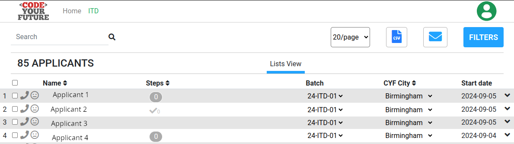
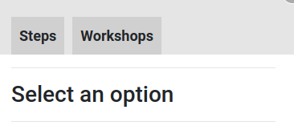
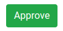
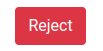
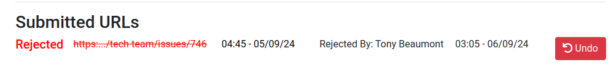

+++
title="Using the CYF Dashboard"
author="Tony Beaumont"
time=15
+++

## Using the dashboard: Seeing Applicants

If you click on `See Applicants` in the **New Applicants** box, you will see a list of all the new applicants. 

The blue Email button allows you to email applicants.
In my screen I can download a CSV file containing the details of the applicants, but you may not have this option.

You can use the `FILTERS` button to filter the view and see applicants in different areas, or limit the steps displayed. This screenshot shows some of the filter options: 

## Using the dashboard: Reviewing work submitted by applicants

If you click on `Review Steps` in the **Steps** box you will see a list of those applicants who have submitted work for one or more of the steps in the ITD syllabus. The view is a subset of all the applicants and looks similar: 
 
_ You can see that `Applicant 1` has submitted work for Step 0 but it hasn't yet been approved. That is indicated by the `0` in the **Steps** column.  
 _ `Applicant 2` has also submitted work for Step 0 and it has been approved because there is a tick AND a 0 in the **Steps** column.

### How to view submissions

- Click on the **name** of one of the applicants. You will see a menu appear like this one: 
  .
- If you click on **Steps** you will see what the applicant has submitted for the ITD steps. The example below shows the applicant has submitted work for three steps and you are looking at their submission link for STEP 1:
  
  Clicking the **Submitted** link will allow you to see their submitted work.

### How to review a submission

When reviewing a submission there are three things you can do:

- **Communicating with the applicant**: If you click the **Comments button** 
   
  you can see comments left by other volunteers and add your own comments. You should post a comment back to the applicant if you have questions and you are not yet able to approve or reject the work. It is also good practice to post a comment when you reject a submission so the applicant can see why their work was rejected. You can comment after approving work to highlight what the applicant did well.
- **Approving work**: When you are ready to approve the submitted work as meeting the acceptance criteria, click the **Approve button**. If you want to highlight work that you thought was good practice (or bad practice), leave a comment. 
   
  Do not approve the work unless it meets the acceptance criteria.
- **Rejecting work**: If you are rejecting the work as not meeting the acceptance criteria, click the **Reject button** 
   
  You should leave comments to say why the work was rejected.
- **Undoing a decision**: If you want to change your mind about approving or rejecting a piece of work, can click the Undo button as shown in this screenshot: 
   
  You should post a comment to the applicant to let them know why the decision was changed.

## Using the dashboard: Workshops

If you click the **Workshops** option under a applicant's name, you are able to record whether or not they attended a workshop and leave some text as context. Here is what the option looks like: 

