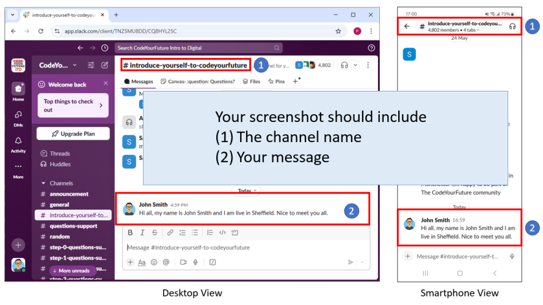

+++
title ="Step 0: What to do"
description= "Join the CodeYourFuture Intro To Digital Slack"
emoji= "🗨"
time= 60
[build]
  render = 'never'
  list = 'local'
  publishResources = false 
+++

#### Todo #1: Join the CodeYourFuture Intro To Digital Slack Workspace (ITD Slack)

The ITD Slack is an environment where you can ask for help and build your local community.

To join the ITD Slack, click the **invitation link** at the CYF Course Platform.

> ![TIP]
> Read the [Slack tutorial](https://slack.com/intl/en-gb/help/articles/360059928654-How-to-use-Slack--your-quick-start-guide) to get started on Slack.

#### Todo #2: Update your Slack profile

Please use a consistent professional name on Slack and add a consistent profile picture. We ask this so we can recognise each other. You don't have to share any information you are not comfortable with.

> [!TIP]
> To learn how to update your Slack profile name, search for `How to update Slack profile` using a search engine.

#### Todo #3: Introduce yourself in the [`#introduce-yourself-to-codeyourfuture`](https://cyf-introtodigital.slack.com/archives/CQ8HYL25C) channel 

#### Todo #4: Take a screenshot of your introduction

Your screenshot should shows the channel name and your message. 

> [!TIP]
> Use a search engine to find out how to take a screen shot on your device.

#### Todo #5: Submit your screenshot to the [CYF Course Platform](https://application-process.codeyourfuture.io/)
