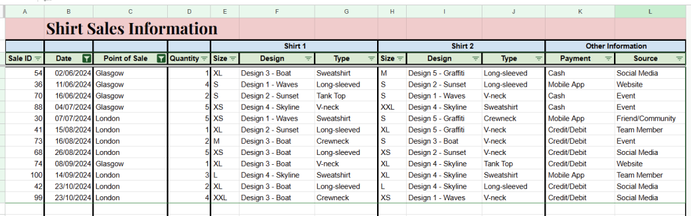

+++
title ="Step 3: What to do"
description= "Working with Google Sheets"
time= 120
[build]
  render = 'never'
  list = 'local'
  publishResources = false 
+++

### Overview

This exercise introduces the basics of Google Sheets — an online tool for organizing data, performing calculations, and managing information efficiently.

### What Should You Do?

##### Watch the videos in the Google short courses 

1. [Google Workspace: Sheets - Part 1](https://edu.exceedlms.com/student/path/1606820-google-workspace-sheets-part-1) (equivalent [YouTube video](https://www.youtube.com/watch?v=2jlgKEx9j_k))
2. [Google Workspace: Sheets - Part 2](https://edu.exceedlms.com/student/path/1606732-google-workspace-sheets-part-2) (equivalent [YouTube video](https://www.youtube.com/watch?v=rRPEDMHdOWY))
   - Only the "Create Filters and Use Filter Views" section

**Note**: If you want to practice with the Google Sheets used in the videos, you can access them through the YouTube links.

##### Apply What You Learned 

1. Make a copy of [this Google Sheet](https://docs.google.com/spreadsheets/d/1uPnnoEbn_YdMp_Wx4oTFgIAV7E5zd8ubFZ_e4Od_pn4/copy?usp=sharing)

1. In your own copy, replace "YOUR_NAME" in the title with your own name

1. Row and Column insertion, and AutoFill
    - Insert a column before column A
    - Insert a row before row 1
    - Enter "Shirt Sales Information" in cell B1 and set the font size to 24
    - Use AutoFill to fill cells A4:A103 with the numbers 1 to 100

1. Format and Freeze Headers
    - Fill rows 1-3 with three different background colors
    - Change the font weight of rows 1-3 to bold
    - Center the text in rows 2-3
    - Freeze rows 1-3 so they remain visible at the top when scrolling vertically

1. Edit Cells
    - Enter "Sale ID" in cell A3
    - Enter "Other Information" in cell K2
    - Change the value in cell K3 to "Payment"
    - Change the value in cell L3 to "Source"

1. Merge Cells
    - Merge cells E2:G2 (three cells, from E2 to G2)
    - Merge cells H2:J2 (three cells, from H2 to J2)
    - Merge cells K2:L2 (two cells, K2 and L2)

1. Adjust Columns and Delete Unwanted Columns
    - Adjust column widths to remove extra space
    - Delete all columns beyond column L (do not delete column L)

1. Apply Border
    - Apply top and bottom borders to rows 2-3
    - Apply left and right borders to columns A-D
    - Apply right borders to columns G, J, and L
    - On row 1, clear all borders except the bottom border
    - On row 3, apply borders to every cell

1. Apply Filter
    - Use filters to show only rows that satisfy both of the following conditions:
      - Condition 1: Point of Sale is London or Glasgow
      - Condition 2: Date is between 1 June 2024 and 31 December 2024
    - Use a filter to order the rows by Date in ascending order

---
Here is a reference screenshot (sample) for you to check if you have successfully applied all the changes.

##### Share your Google Sheet to Public

Set the sharing settings of your Google Sheet to "Anyone with the link can view".

##### Submit the Google Sheet link

Submit the shared link of your Google Sheet in Step 3 on the [CYF Course Platform](https://application-process.codeyourfuture.io/).
