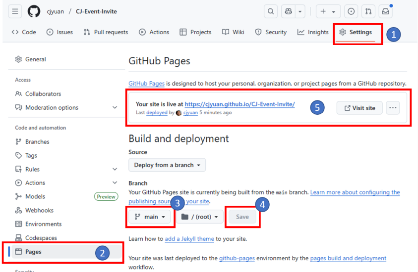

+++
title ="Step 5: What to do"
description= "Deploying a webpage on GitHub Pages"
emoji= "🤖"
time= 300
[build]
  render = 'never'
  list = 'local'
  publishResources = false 
+++

### Overview

In this exercise, you will:
- Upload and manage your project files on GitHub
- Publish your webpage (from Step 4) using GitHub Pages
  
### What Should You Do?

#### 1. Sign up a GitHub account

Create a free account on [GitHub](https://github.com/).


- Need to choose a **professional GitHub username**? Ask an AI assistant for tips on picking one that's clear, simple, and career-friendly.
- Curious **why a professional username matters**? Let AI explain how it can impact your credibility, discoverability, and personal brand.  

**Tip:** Avoid including your birth year in your username - this information could be misused for discrimination.


> [!IMPORTANT]
>
> People sometimes use different names in different contexts (nicknames, shortened versions, or using first and middle names differently).  
>
> For professional purposes, **choose one consistent name** for your accounts and CV. It doesn’t have to match your legal name, but consistency helps employers recognize you.  
>
> Decide on the professional name you will use now and stick with it across all professional contexts.

#### 2. Use AI to learn about GitHub

Before you start uploading files, use AI to explore some key concepts and terminology.
Understanding these will make GitHub easier to use.

Here are some questions you can ask AI:
- What is **GitHub**, and why is it useful for projects like a website?
- What is a **repository** (or **repo**), and how is it similar to a project folder on my computer?
- What is a **commit** and a **commit message**?
- When should I make a **commit**?
- What is **GitHub Pages**, and how is it different from **GitHub** itself?

#### 3. Practice managing a repository on GitHub

##### A. Create a repository with a `README.md` file

Follow this guide to create your first repository:  
👉 [Quickstart for repositories - Create a repository](https://docs.github.com/en/repositories/creating-and-managing-repositories/quickstart-for-repositories#create-a-repository)

##### B. Edit the `README.md` file

Follow this guide to make your first edit in GitHub:  
👉 [Quickstart for repositories - Commit your first change](https://docs.github.com/en/repositories/creating-and-managing-repositories/quickstart-for-repositories#commit-your-first-change)


While editing the `README.md`, ask AI these questions to understand it better:

- What is the purpose of the `README.md` file in a repository?
- What information is usually included in `README.md`?
- What is **Markdown**, and how is it different from **plain text**?


##### C. Managing files

Read: [Managing Files -- GitHub Docs](https://docs.github.com/en/repositories/working-with-files/managing-files)  
This explains how to **add**, **edit**, **rename**, and **delete** files.

👉 Important:
  - Follow only the instructions for using the GitHub website.
  - Skip anything that involves the command line or the `git` command.

#### 4. Create a repository for your website

1. **Create a repository** and include your name in the repository name.
    - The repository name will appear in the link to your webpage.
    - This helps identify your work. You can use your first name, last name, or a combination.

2. **Download your webpage files from CodePen**
    - Go to the CodePen page you prepared in Step 4 and **export** your webpage as a ZIP file.
    - The **Export** button is located in the lower-right corner of the CodePen page. (See [Exporting Pens](https://blog.codepen.io/documentation/exporting-pens/) for more information.)
  
3. **Unzip the downloaded file** into a local folder on your computer.
   
4. **Upload your webpage files to GitHub**
   - **Important**: Only upload the files in the `dist/` subfolder to your repository.
   - Optionally, you can add your own images to your repository and edit your code on GitHub to use them.

5. **Add a brief description** of your project in the `README.md` file.

#### 5. Deploy your webpage on GitHub Pages

1. In your repository, click **Settings**.
2. Select **Pages** from the sidebar.
3. Choose the branch you want to deploy. Typically, this is the `main` branch.
4. Click **Save** to apply the branch setting.
5. Reload the settings page every few minutes until you see the message: "Your page is live at ..."
   - Click the link to visit your webpage. (**This is the link you will submit**.)
   - Deployment may take a few minutes.

For detailed instructions, see: [Configuring a publishing source for your GitHub Pages site](https://docs.github.com/en/pages/getting-started-with-github-pages/configuring-a-publishing-source-for-your-github-pages-site)

#### 6. Submit your webpage link  

Submit the link to your deployed webpage in Step 5 on the [CYF Course Platform](https://application-process.codeyourfuture.io/).


If you’re not sure where to find your links, try asking AI:
- How do I find out the link to my repository?
- How do I find out the link to my webpage deployed on GitHub Pages?

