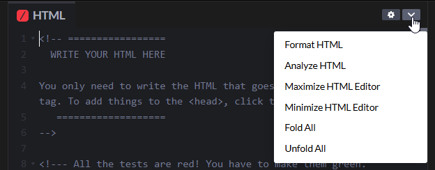

+++
title ="Step 5: What to do"
description= "Build a personal home page on CodePen"
emoji= "🤖"
time= 300
[build]
  render = 'never'
  list = 'local'
  publishResources = false 
+++

### Overview

**CodePen** is an easy-to-use website where you can build and preview simple web pages using HTML, CSS, and JavaScript—right in your browser—and easily share your work with others using a link.

In this exercise, you must build your own homepage on CodePen that meets some specific requirements. Give it your own personal touch. We know that people who do well on our courses show **creativity**, **curiosity**, **persistence**, and **rigour**. That’s what we’re looking for from you in this project.


- Make good use of web search and AI.


### What Should You Do?

##### 1. Make a free account on CodePen
- Sign up for a free account on [CodePen](https://codepen.io/).

##### 2. Fork the CYF starter page

1. Fork (make a copy of) the CYF starter page [Personal Home Page Template](https://codepen.io/IntroToTech/pen/PomeEod) to your own CodePen account.
    - Here are the [instructions to fork a CodePen page](https://blog.codepen.io/documentation/forks/).
    - Make sure you're logged into CodePen when you fork the page so that your work is saved.
 

- The CYF template is set up to use JavaScript to check whether your HTML code passes 10 automated tests.
- You must not modify the JavaScript code.


##### 3. Prepare your homepage

1. Prepare your homepage in the page you forked.
2. Write your HTML code in the **HTML** tab and your CSS code in the **CSS** tab.
    - You may delete the HTML comment in the **HTML** tab.
3. Your homepage must meet the following criteria, which are written in a special format called _Given/When/Then_.


**Given a personal homepage**

**When** I look in the test console  
_Then_ all 10 tests are passing

**When** I read the content  
_Then_ I learn something about you

**When** I view the page  
_Then_ the design is unique and the images are displayed properly

**When** I play the video on the page
_Then_ the video can play normally

**When** I validate the HTML
_Then_ the HTML is valid


##### 4. Validate your code

1. Use CodePen’s "Analyze HTML" feature to help you find errors in your HTML code. Then fix the errors yourself manually.

2. Use a similar approach to identify and fix CSS errors.

##### 5. Submit your CodePen page link  

Submit the link to your CodePen page in Step 5 on the [CYF Course Platform](https://application-process.codeyourfuture.io/).

> [!TIP]
> Your work is not judged on aesthetics in this project. We are interested in code correctness and specification compliance.

<!--
### Advice

<!--
**Use and read the tests** to discover the other 10 requirements. Build, test, and improve your code progressively. The tests are written in the Javascript window in Codepen for you to see, and there’s a readout in the main view showing the results. Don’t worry that you don’t understand the brackets and arrows, **read the words**. The tests will rerun every time you make a change in your code.

Once you're done, submit the URL of your working project with all its tests passing, to the dashboard.
-->
