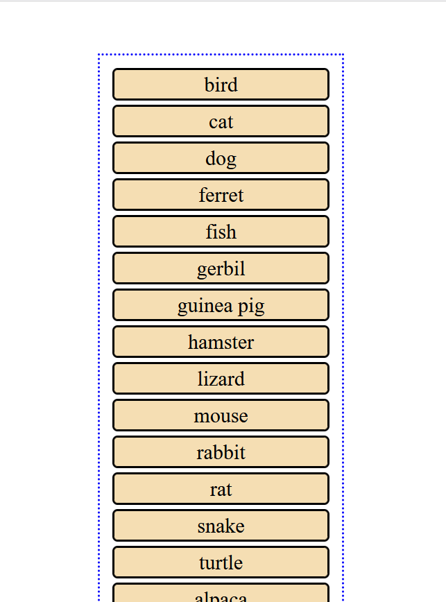

+++
title ="Step 6: Extend Your Skills"
description= "Optionally add responsive design for smaller screens"
emoji= "👀"
time=5
[build]
  render = 'never'
  list = 'local'
  publishResources = false 
+++

#### Add Responsive Design 
This is an additional task for those who want to stretch themselves and try something else. It is not compulsory in anyway.

The task is to make the page look like the below on screen sizes below 500px wide:

You will need to use media queries.