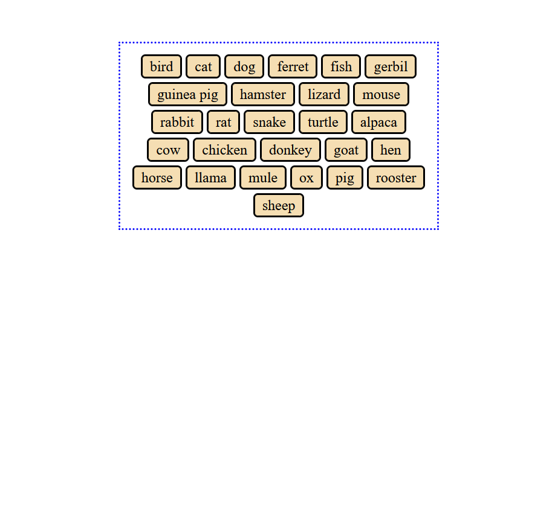

+++
title ="Step 2: What to do"
description= "Learn how to use AI appropriately"
emoji= "🤖"
time= 90
[build]
  render = 'never'
  list = 'local'
  publishResources = false 
+++

### Overview
As covered in step 2, generative AI tools such as ChatGPT can be a great help in your studies with CodeYourFuture. However, the way you use them is very important. These tools can just as easily be a great obstacle to your learning if you let them do your thinking for you.

This step is an opportunity to practice this with a practical task which is outside your current knowledge of CSS and HTML. We have provided a [CodePen](https://codepen.io/Ara225/pen/JoYbRVd) which contains some HTML code. Your task is to use CSS to style the HTML so that:
- The element with the class of "parent" has a dotted border
- The div elements with the class "child" have background colors, borders, rounded corners and margins between them.
- The 

You will need to submit a link to your AI chat, so please use an AI tool which allows for chats to be shared by link, such as ChatGPT or Gemini. 

https://support.google.com/gemini/answer/13743730?hl=en-GB&co=GENIE.Platform%3DDesktop#zippy=%2Cwhy-cant-i-share-a-chat

https://help.openai.com/en/articles/7925741-chatgpt-shared-links-faq#h_d543d7453b

### What Should You Do?

#### 1 - Fork the CodePen
We have provided a code