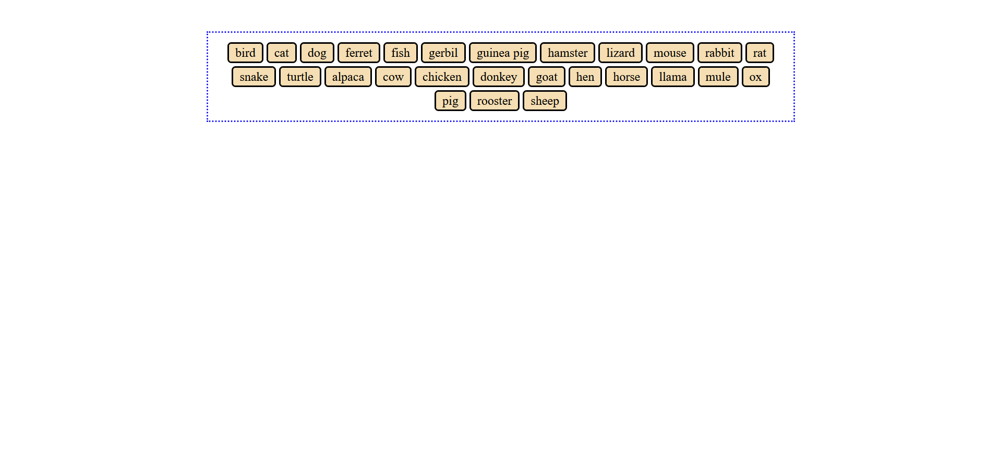

+++
title ="Step 6: What to do"
description= "Use AI appropriately to solve a noval CSS problem"
time= 90
[build]
  render = 'never'
  list = 'local'
  publishResources = false 
+++

### Overview
As covered in step 2, generative AI tools such as ChatGPT can be a great help in your studies with CodeYourFuture. However, the way you use them is very important. These tools can just as easily be a great obstacle to your learning if you let them do your thinking for you.

This step is an opportunity to practice this with a practical task which is outside your current knowledge of CSS and HTML. We have provided a [CodePen](https://codepen.io/Ara225/pen/JoYbRVd) which contains some HTML code. Your task is to use CSS to style the HTML so that:
- The element with the class of "parent" has a dotted border
- The element with the class of "parent" is centered on the page even if the screen size changes
- The div elements with the class "child" have background colors, borders, rounded corners and margins between them.
- The div elements with the class "child" stay inside the element with the class parent even if the screen size changes

You must not change the HTML in anyway.

You may use any colors you like - they aren't the important bit in this task.

Here are some visual examples:

#### On a large screen

#### On a much smaller screen

Assuming you were new to HTML and CSS when you started this course, this task is outside your current knowledge. This makes it an excellent candidate for AI assistance, as you can use AI to help you understand the new concepts.

### What Should You Do?

**You are not allowed to have AI write code for you. You must write your own code.**

#### 1 - Fork the CodePen
Fork the [exercise CodePen](https://codepen.io/Ara225/pen/JoYbRVd) into the CodePen account you created in step 4. 

#### 2 - Make a Plan 
Start by thinking about what you need to know to solve this problem. What might be a good first question to ask the AI? How can you avoid having the AI do your thinking for you?

#### 3 - Interact with the AI
Use an AI tool to help you solve the problem. This can mean asking it to explain concepts, provide examples, explain code, etc. It must not mean copying code from the AI or blindly following its advice without understanding why. You may wish to look at step 2 again and/or search resources for using AI appropriately. If you're stuck, Google or ask in the #step-6-questions-support channel on Slack.

> [!NOTE]
> You will need to submit a link to your AI chat, so please use an AI tool which allows for chats to be shared by link, such as ChatGPT or Gemini. 

#### 5 - Self Check
Look over the code you have written. Do you understand it all? Has any been pasted from an AI tool or elsewhere? What worked and what didn’t work when prompting the AI?

#### 4. Create a Google Doc
Create a Google Doc

> [!NOTE]
> If you are new to Google Docs, you may find this [guide on what Google Docs is and how to use it](https://support.google.com/docs/answer/7068618?hl=en-GB&co=GENIE.Platform%3DDesktop) useful.

#### 5. Put your name in the document name 

Include your given name or your family name in the title of the Google Doc.


`How to change document name in Google Docs`


#### 6. Make your Google Doc public

Change the sharing settings of your Google Doc to "Anyone with the link can view".


`How to share Google Docs to public`


#### 7 - Fill out your Doc
Please add the following to your google doc:
- A link to your CodePen (please note that volunteers probably won't give you a full code review but this is useful context for them)
- A link to your chat with the AI - Instructions to share links [to Gemini chats are here](https://support.google.com/gemini/answer/13743730) and [to ChatGPT chats are here](https://help.openai.com/en/articles/7925741-chatgpt-shared-links-faq)
- A screen shot of the output in CodePen
- Your answers to the questions in the '5 - Self Check' section above 

#### 4. Submit the Google Doc link

Submit the link to the Google Doc in Step 6 on the [CYF Course Platform](https://application-process.codeyourfuture.io/).
