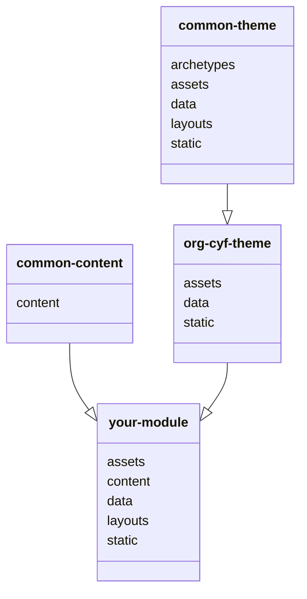

# Code Your Future Curriculum

This is a Hugo module. Mount this to your Hugo site by adding it to your `config.toml` file:

```toml
[module]
[[module.imports]]
path = "github.com/CodeYourFuture/curriculum/org-cyf-theme"
```

It will configure your site with common theme, common content, and CYF default config and brand. This is not a website deployed anywhere. It's an add on to common theme with just CYF assets, so you don't need to repeat those files in your setup. It will mount a `/static `folder with things like icons, an `/assets` folder with things like custom CSS and images, and a `/data` folder with things like funding partners and course descriptions. These will be added as a virtual filesystem, so you can use them automagically in your own CYF site.

The settings in this theme will be inherited once you've mounted it. You can override them in your site's `hugo.toml` file.

https://gohugo.io/hugo-modules/configuration/#module-configuration-mounts

For detailed set up instructions for your own website, please read the org README.md file [org-cyf](../org-cyf/README.md).

## Modules have a cascading inheritance


