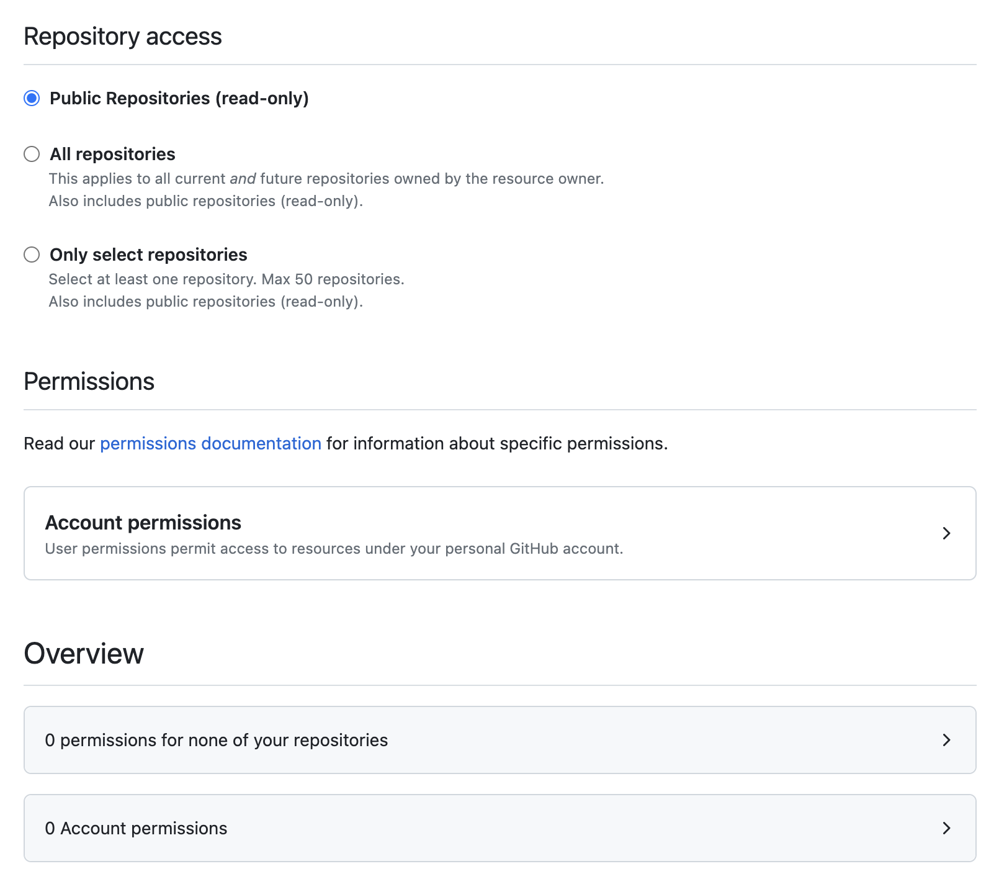

# Code Your Future Curriculum

[](https://app.netlify.com/sites/cyf-curriculum/deploys)

https://curriculum.codeyourfuture.io/

## Tools

- [Hugo](https://gohugo.io/) - Static site generator
- [Hugo Pipes](https://gohugo.io/hugo-pipes/introduction/) - Asset pipeline
- [Netlify](https://www.netlify.com/) - Hosting and deployment
- [GitHub](https://github.com/CodeYourFuture/CYF-Signposts) - Source code repository
- [Bash](https://www.gnu.org/software/bash/) - Bash script to create new module structures

## Developing the source website

### To install

```bash
brew install go hugo
```

### To run locally

#### Generate a token

You'll need to get a fine-grained GitHub API token which allows read-only access to all public CYF repos from [this page](https://github.com/settings/tokens?type=beta).

Click "Generate new token", enter a token name (can be anything), and how long you want the token to last (if you're doing a one-off contribution, pick a short value; if you're going to be a regular contributor, maybe a longer value).

Make sure the Resource owner is _your_ account if you have a choice.

The "Repository access" you need is "Public repositories (read-only)", and you don't need any account permissions:

<details>
<summary>Open to view screenshot of the required permissions</summary>



</details>

#### Set up `.env`

Copy the `.env.example` file over to the parent directory of this one (the root of curriculum) and name it `.env`. Edit the file and then change the line that says `HUGO_CURRICULUM_GITHUB_BEARER_TOKEN` to contain the token that you have generated earlier.

#### Run this command

Run this command in a terminal, substituting in the github API token you generated above:

```bash
npm i
npm run start:dev
```

If you find the build is very slow, and don't care about the issues being pulled into backlogs being precise, you can run:

```bash
npm run start:dev -- --environment issues-are-cached-and-incomplete
```

### To create a new module

```bash
./create_module <module-name>
```

### Linting

All CYF repos use the Prettier standard. However, Prettier doesn't have golang by default so you must install a plugin for it to work in VSCode. I've included it in the package.json.

### Site Search

PageFind runs the search. https://pagefind.app/
It's in the build command on Netlify `hugo && npx pagefind --source "public"`
If you need to develop on this locally, run:

```zsh
rm -rf public &&
hugo && npx pagefind --site "public" --serve
```

And go to http://localhost:1414/ to see the PageFind-served site with search enabled; but there is no hot reload. You can run hugo on http://localhost:1313/ at the same time.

## Contributing

To add content via GitHub, open a PR, following the CONTRIBUTING.md guidelines and PR template.

[](./contributing)

<!-- ALL-CONTRIBUTORS-BADGE:START - Do not remove or modify this section -->

[](#contributors-)

<!-- ALL-CONTRIBUTORS-BADGE:END -->

Code Your Future helps people who need it most to reach their goal of working in tech. Our innovative programme supports people all the way into secure employment as a software engineer.

**Our trainees are people living in poverty**, disabled people, long term unemployed, refugees, asylum seekers, ex-offenders, single parents, and anyone else facing material barriers to digital education and employment in tech.

**Our graduates work in great companies** including Capgemini, Deloitte, JP Morgan, Financial Times, AWS, Thoughtworks, the BBC, AND Digital and many more.

**All our classes are free and our teachers are volunteers.** Our volunteers are professionals working in the local tech sector and they lead our course delivery.

**We build communities and networks of inclusion everywhere we go**, bringing different worlds together, and integrating people into their local communities, teachers and learners both. We come together for a live session at the weekend, and trainees work through coursework and projects 20 hours a week, independently around their commitments, including day jobs.

**CYF was founded by migrants for refugees**, and now welcomes everyone facing material barriers to technical education. Starting with a class of 6 people in 2016, and growing every day, we have helped over 240 people start their career in tech.

## Our Approach

We do our work in public; our courses are free and open source and we develop them in public as FOSS projects on GitHub. Right here!

## Documentation

In this curriculum you'll find the content that we teach at CodeYourFuture. For other operational details you should read [our documentation website](https://docs.codeyourfuture.io).

## Contributing

Please read CONTRIBUTING.MD


