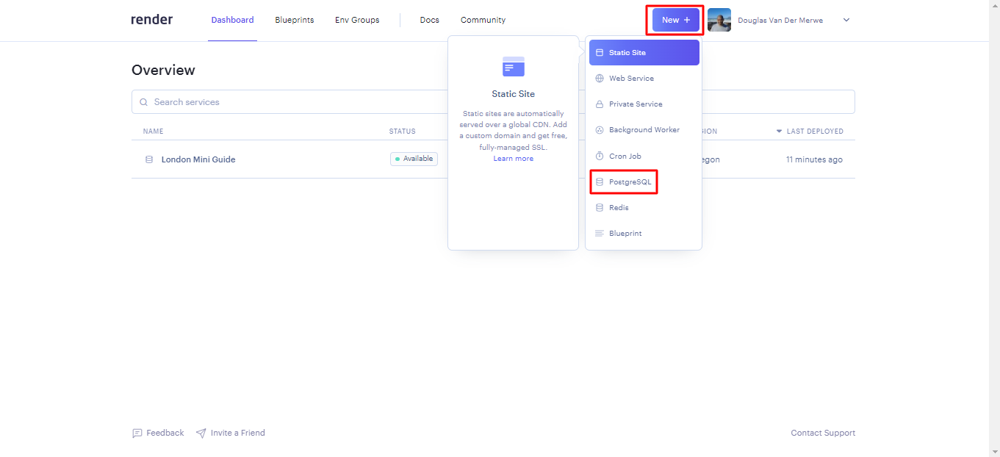
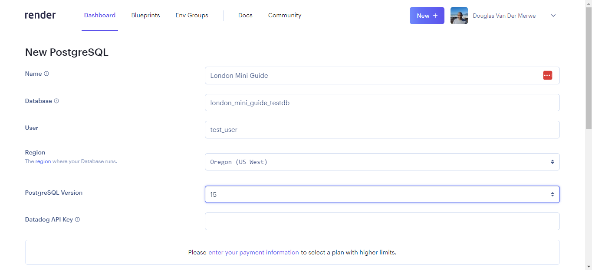
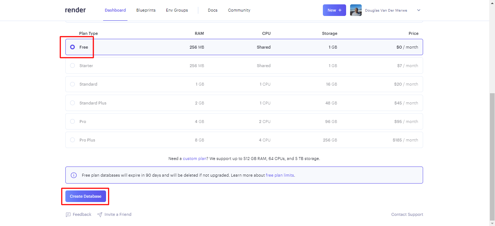
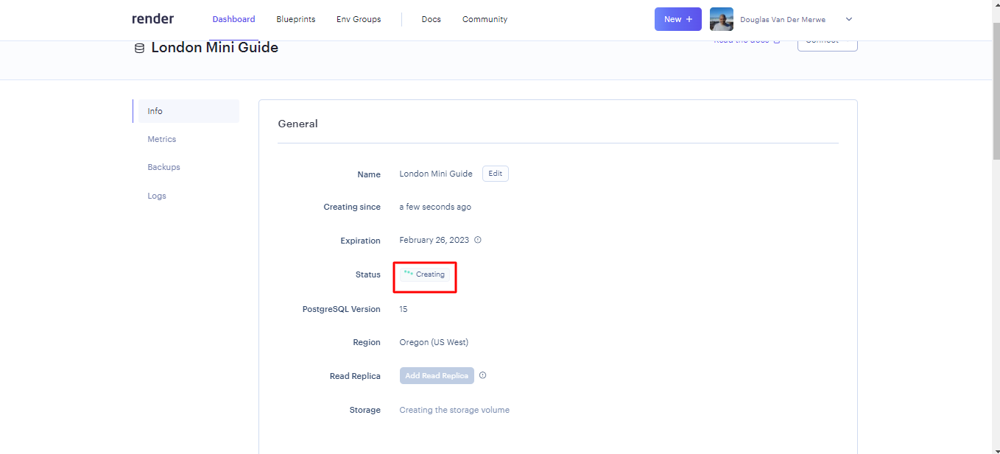
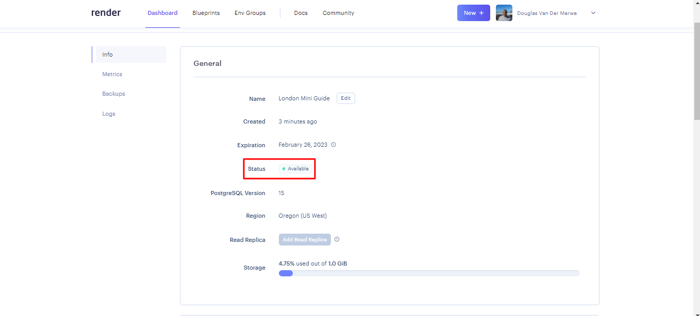
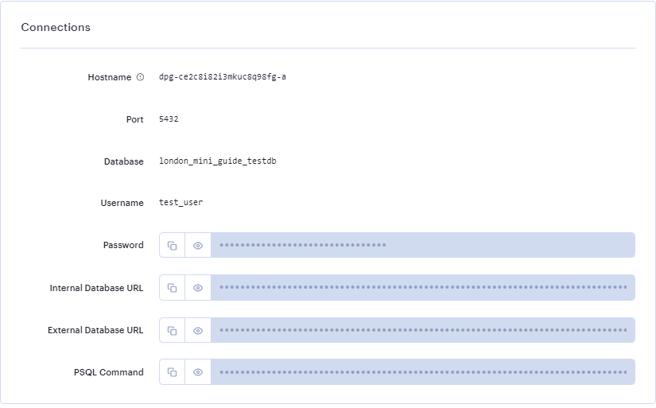
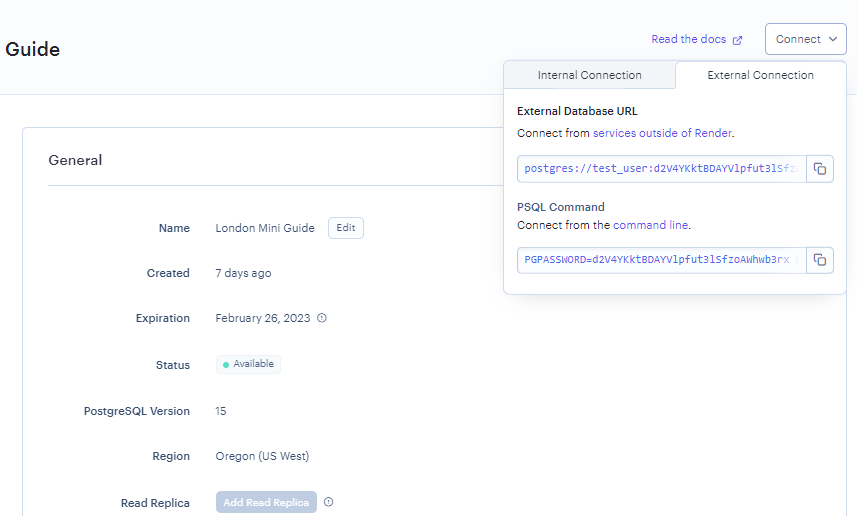

1. Click on the New + button, then click on PostgreSQL

2. Fill out the Name field, which will be used to label the database within Render. Fill out the Database and User fields, which should be the same as your development setup - ask a volunteer if you are unsure. Leave the remaining 3 input fields as is with the default values

3. At the bottom of the form, the Free plan should be selected by default. Click Create Database button

4. Render will take a few minutes to create your database

5. After a few minutes your Database should be active

6. Scroll down to Connections tab, where you will find Environment Variables for connecting to your database. The Internal & External Database URLs will likely be the most useful for you

7. The Connect button could be useful for quick Environment Variable reference

