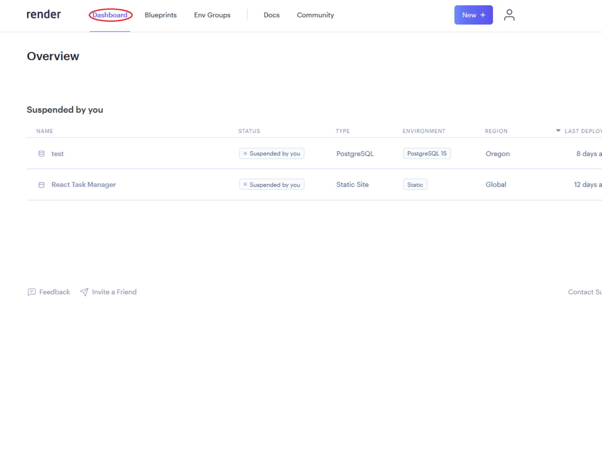
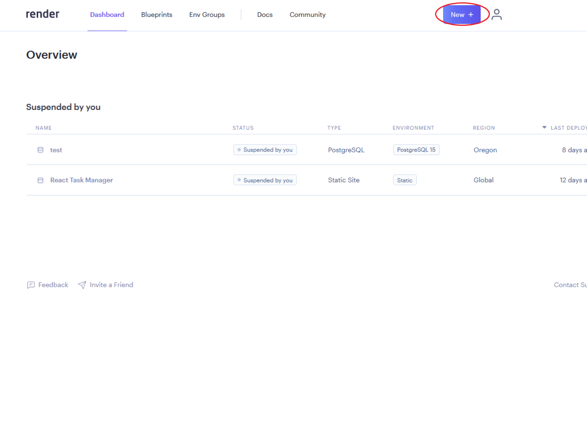
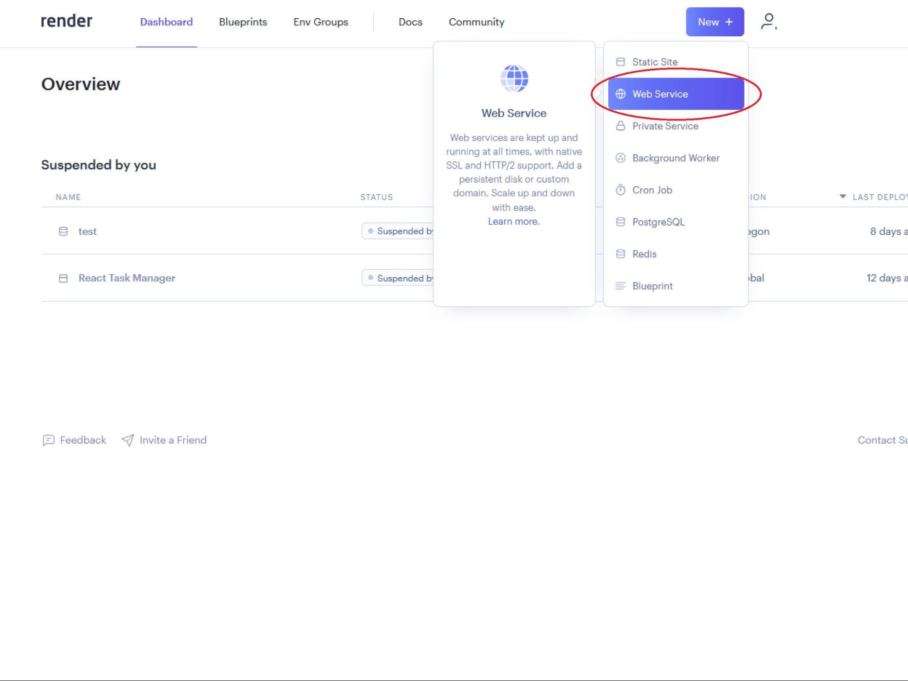
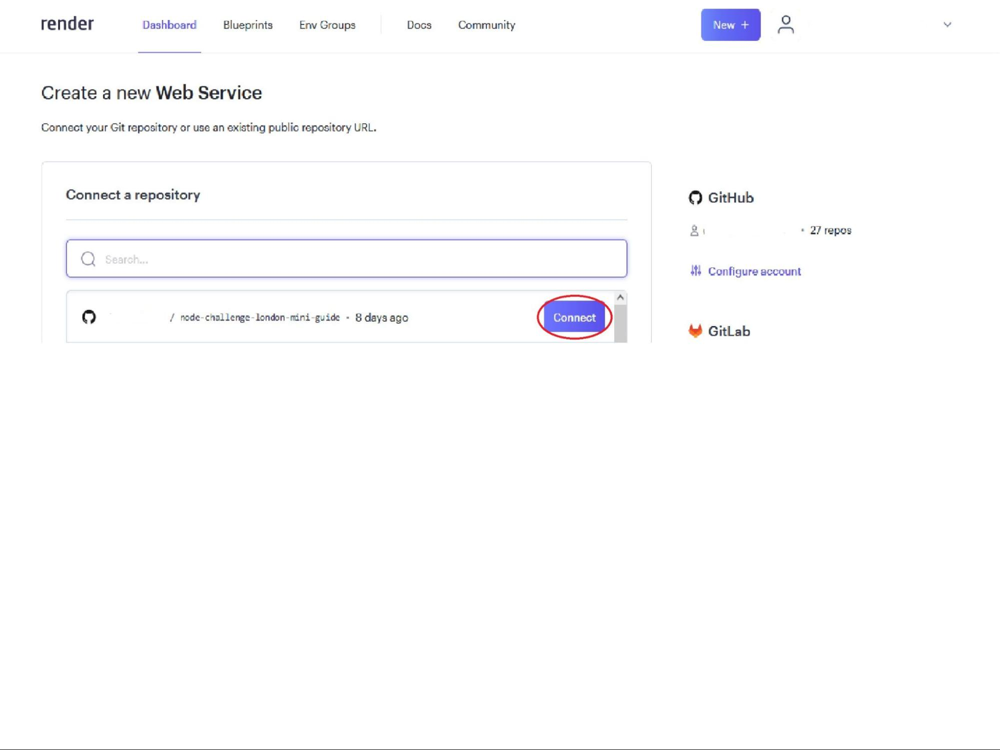
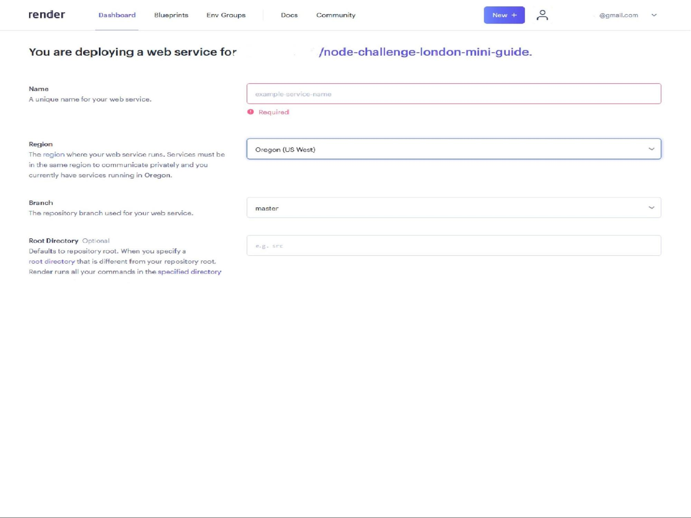
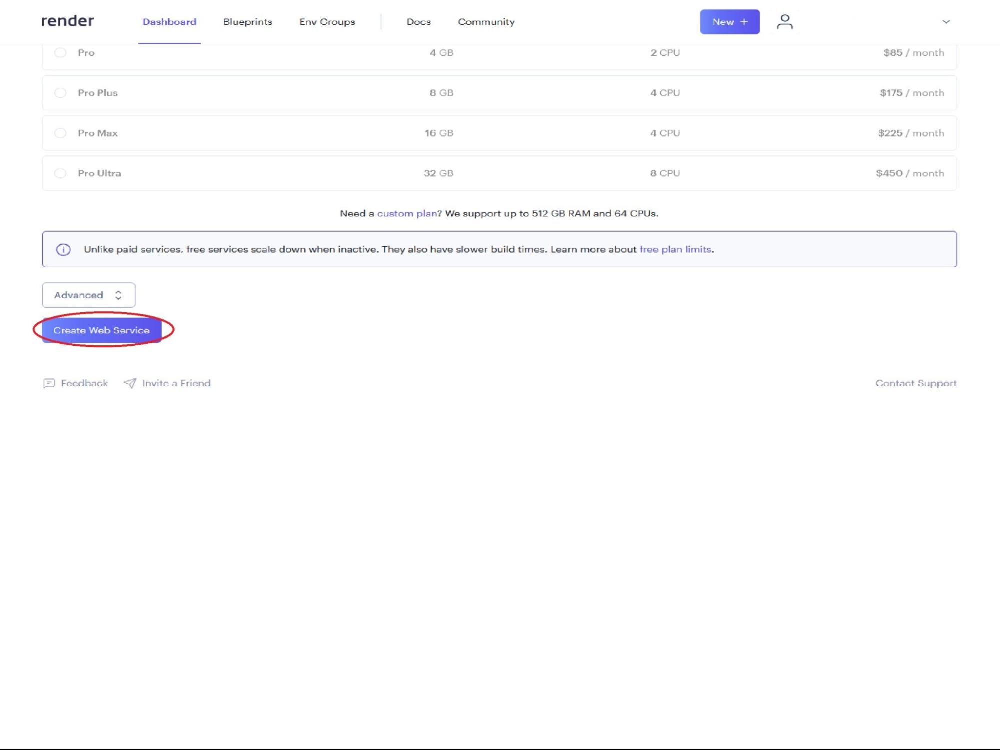
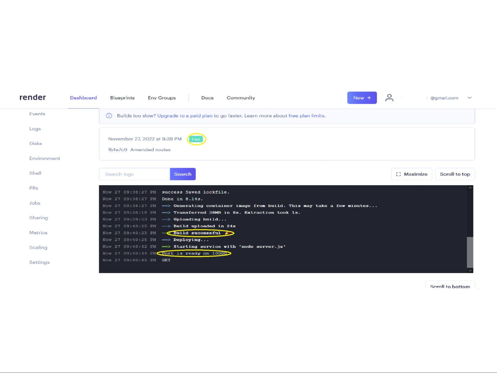
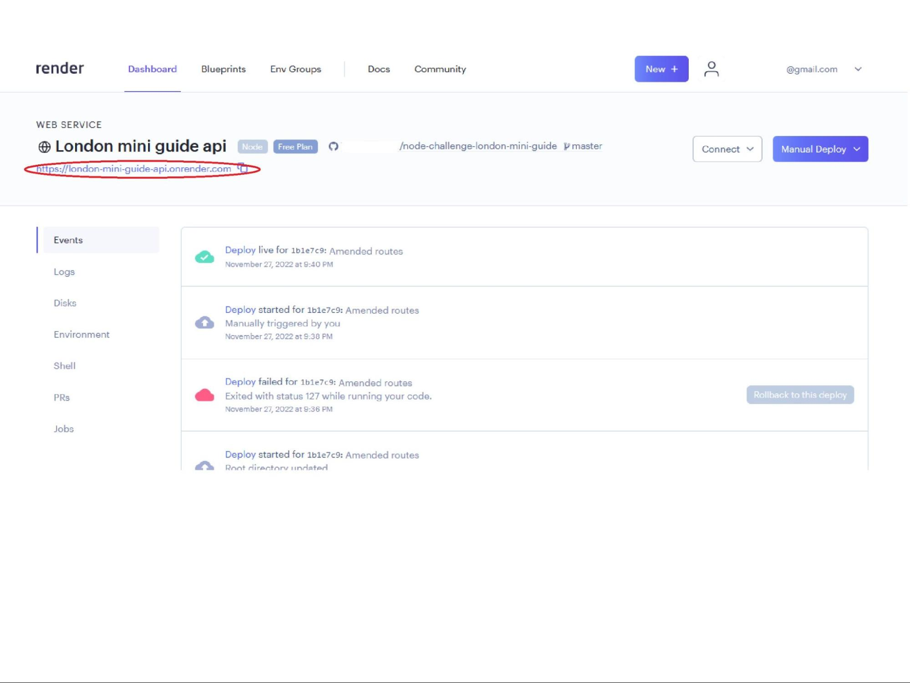

1. Make sure you have connected your GitHub account to Render (see [How to connect your GitHub to Render](connecting-github.md))

2. 

3. 

4. 

5. 

6. 

7. 

8. 

9. You should have been taken to the Build page for your new server

10. 

11. 
