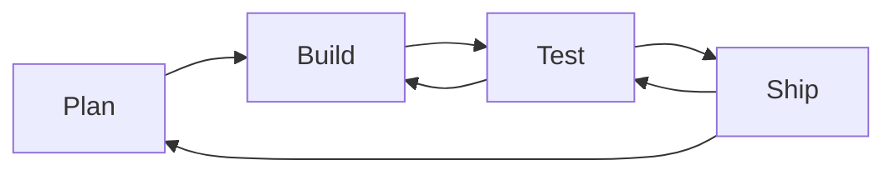

+++
title = 'plan'
description = 'Over the next few weeks, you will build a website and deploy it to the internet.'
layout = 'plan'
menu_level = ['product']
emoji= '🎁'
weight = 1
+++

## Schedule

- **Week 1** you will deliver an HTML page (like the page written during the application process) to Netlify
- **Week 2** you will iterate on that page in response to feedback/requirements gathering (modifying the HTML/CSS)
- **Week 3** you will iterate on that page a second time and add a feature implemented through block-based coding
- **Week 4** you will submit your product as part of your application to the Software Development Course

## Overview

We will work on this product together in class and you will develop it during the week as part of your coursework.

This is your first product. You will submit your product as part of the application process for the Software Development Course.

The website you end up with should be quite different to the one you began with. You will discover new requirements as you go, and you will need to adapt your website to meet those requirements.

Your plan will evolve as you get more information, and you will use your planning board to help you track your progress.



- Decide everything without discussion
- Write the whole product in one go
- Complete the whole product before showing it to anyone





- Discover requirements
- Make **small, incremental changes** to a product
- Test their changes
- Respond to feedback
- Adapt to changing requirements



Reflection: Can you think why professional developers work this way?
